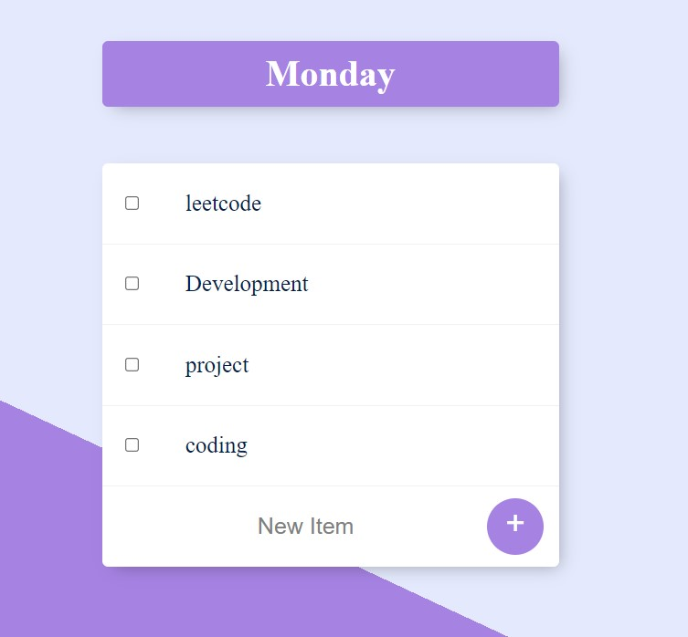

<h1>To-do Lists</h1>

   This is a web application used to create To-do lists and list tasks to do. We can add and delete any number of tasks in the list. Also we can create new lists by adding parameters to the website path

 I also hosted the website in a shared server using render <a href="https://todolist-ul4m.onrender.com/">Click Here</a> to go to the website. The website might load slowly, please wait patiently as the server is shared and free

 The image you see below is the starting list you see when app is started

<h2>Creating lists</h2>

We can create new lists by giving parameters to the path of the website. for suppose if we want to create a work list. we can give '/work' as a parameter to create work list.

<h2>Adding and Deleting</h2>

We can easily add or delete items in the list. to add type an item and click + button. to remove just check the checkbox

